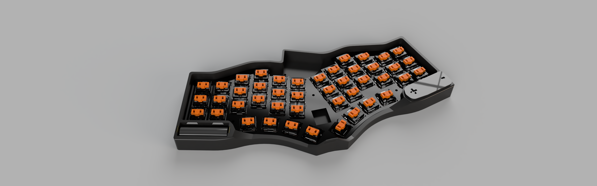
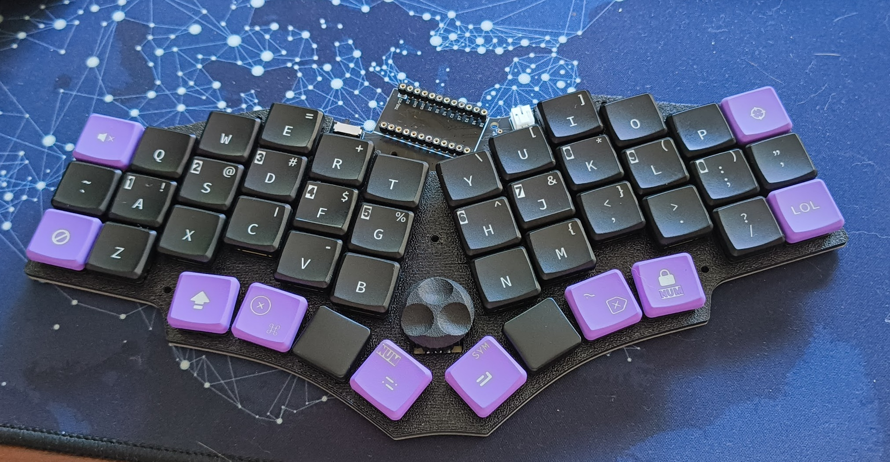

# Chocorang44

Chocorang44 is a Chocotako44 fork (which is a Choctopus44 mod) that features a case redesign and updated ZMK config.

Optimised for low profile form factor and portability including magnetic case cover and larger parallel batteries.

See [Case](https://github.com/WernerVdM97/Chocorang44/tree/master/case)

View [Keymap](https://github.com/WernerVdM97/Chocorang44/blob/master/config/boards/shields/choctopus44/choctopus44.keymap)

## Todo

### ZMK

- [x] Basic layer functionality based on KLORista
- [x] Forked ZMK for pinned version
- [ ] LOL layer
- [ ] WASD (on DSCF) layer

### Case
- [x] Bottom case
  - [x] Rubber feet inslits
  - [x] Reset hole
  - [x] Battery mounts
  - [x] Battery snap lid
  - [x] nRF Shield
  - [x] Magnet gaps
- [x] Top lid
  - [x] Magnet gaps

### Dongle/Interface ?
- [ ] CAPS LED
- [x] POWER LED 
